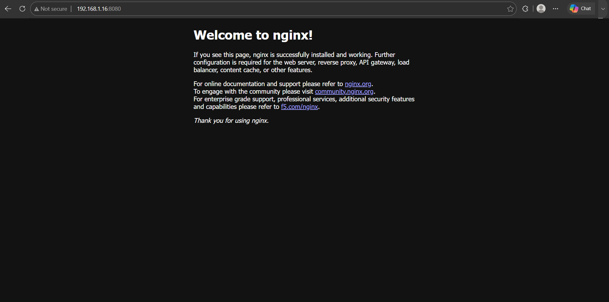

# Project_Work
# Infrastructure & Sysadmin Portfolio

## Project 1: VirtualBox SSH Access
- **Configuration**: VirtualBox Bridged Adapter (IP: `192.168.1.16`).
- **Services**: Installed `openssh-server`, opened UFW port 22 (`sudo ufw allow 22/tcp`).
- **Verification**: Verified via host SSH session (`ssh ali@192.168.1.16`).

## Project 2: Docker Web Server

- **Setup**: Installed Docker & `docker-compose-v2`, added user to `docker` group.
- **Deployment**: Deployed Nginx container (`docker run -d -p 8080:80 --name my-webserver nginx`).
- **Verification**: Accessible via browser at `http://192.168.1.16:8080`.

## Project 3: GitHub Documentation & Portfolio Setup
- Configured Git on Ubuntu VM and linked to remote GitHub repository.
- Set up authentication using a GitHub Personal Access Token (PAT).
- Documented project architecture and commands directly in Markdown format.
-
